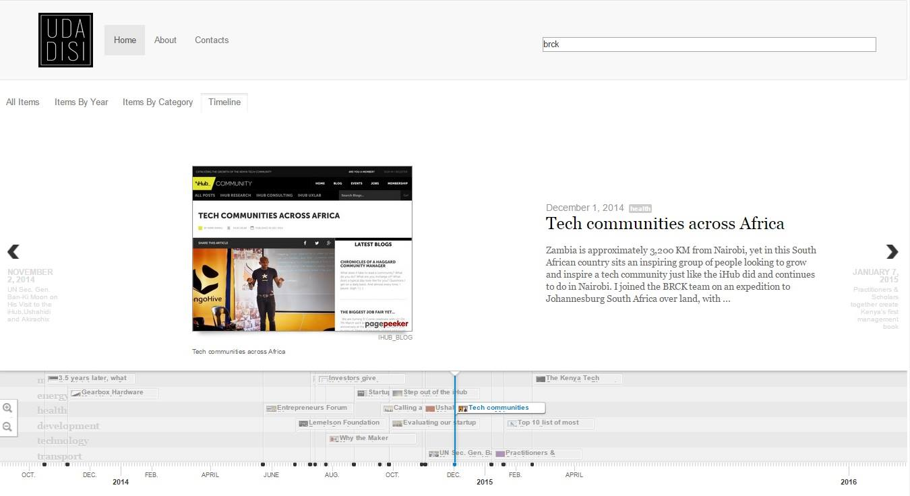

Udadisi
===============
As part of [SmartDataHack 2015](http://smartdatahack.org/2015/#udadisi), Olaf, [Judy](https://github.com/maeyoko), [Mateusz](https://github.com/eramateusz) and Katie Hartin formed a team to respond to [Practical Action's](http://practicalaction.org/) Challenge: how can data from social media and news media sources build a picture of innovation in and around Nairobi, Kenya?

Udadisi, meaning "curiosity" in the Swahili language, is a trend detection and exploration platform. Our goal was to visualize a history of news data in a way that is informative and tells a story about various types of emerging technology in this dynamic and vibrant city.

Real-world applications
---------------
### [Energy Archipelago](http://energyarchipelago.com)
Energy archipelago is a community renewable energy platform with mapping, statistics and trends. Here Udadisi has been adjusted to Scene's data sources and clean energy categories. While aiding the consultancy in its research, the tool is freely available to anyone under the [Trends section](http://energyarchipelago.com/#/trends).

### [Udadisi.com](http://udadisi.com)
An offshoot of the hackathon, developed by Practical Action, this version focuses on trend exploration by location. Support for Lima, Dhaka and Nairobi has been added at the time of writing.

